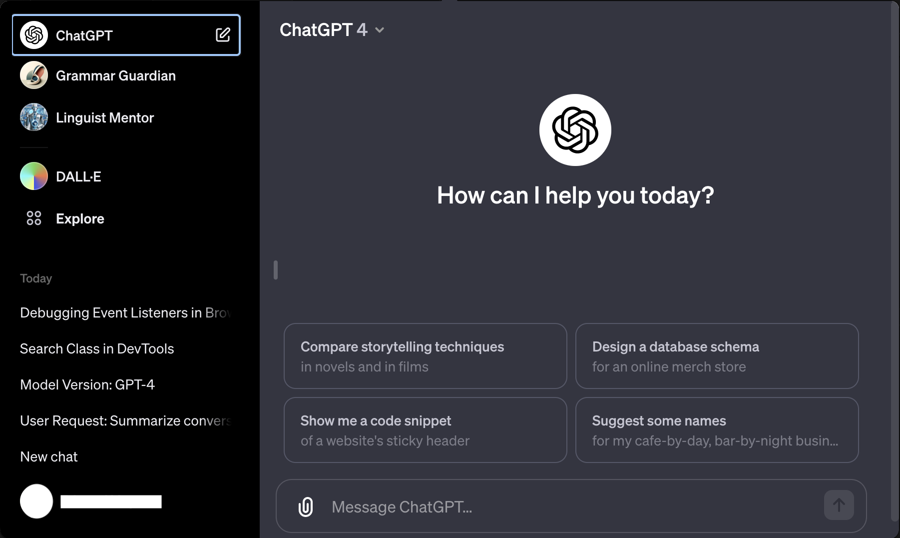

# Source

forked from [vincelwt/chatgpt-mac](https://github.com/vincelwt/chatgpt-mac)

# ChatGPT for desktop

This is a simple app that makes ChatGPT live in your menubar.

You can use Cmd+Shift+G (Mac) or Ctrl+Shift+G (Win) to quickly open it from anywhere.

  

## Credit

All credit and copyrights goes to OpenAI.
